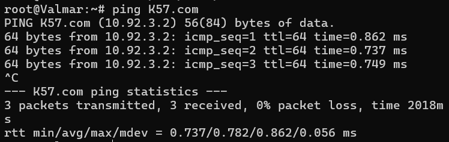

# Jarkom-Modul-1-2025-K57

### Member
1. Prabaswara Febrian 5027241069
2. Erlinda Annisa Zahra 5027241108

### Soal 1

Membuat alamat dan default gateway tiap tokoh sesuai glosariumnya.

    #Eonwe: 
    # WAN (ke NAT)
    auto eth0
    iface eth0 inet dhcp

    # Barat
    auto eth1
    iface eth1 inet static
        address 10.92.1.1
        netmask 255.255.255.0

    # Timur
    auto eth2
    iface eth2 inet static
        address 10.92.2.1
        netmask 255.255.255.0

    # DMZ
    auto eth3
    iface eth3 inet static
        address 10.92.3.1
        netmask 255.255.255.0

    up iptables -t nat -A POSTROUTING -o eth0 -j MASQUERADE -s 10.92.0.0/16

    #Earendil:
    auto eth0
    iface eth0 inet static
        address 10.92.1.2
        netmask 255.255.255.0
        gateway 10.92.1.1

    #Elwing:
    auto eth0
    iface eth0 inet static
        address 10.92.1.3
        netmask 255.255.255.0
        gateway 10.92.1.1

    #Cirdan:
    auto eth0
    iface eth0 inet static
        address 10.92.2.2
        netmask 255.255.255.0
        gateway 10.92.2.1

    #Elrond:
    auto eth0
    iface eth0 inet static
        address 10.92.2.3
        netmask 255.255.255.0
        gateway 10.92.2.1

    #Maglor:
    auto eth0
    iface eth0 inet static
        address 10.92.2.4
        netmask 255.255.255.0
        gateway 10.92.2.1

    #Sirion:
    auto eth0
    iface eth0 inet static
        address 10.92.3.2
        netmask 255.255.255.0
        gateway 10.92.3.1

    #Tirion: (ns1)
    auto eth0
    iface eth0 inet static
        address 10.92.3.3
        netmask 255.255.255.0
        gateway 10.92.3.1

    #Valmar:(ns2)
    auto eth0
    iface eth0 inet static
        address 10.92.3.4
        netmask 255.255.255.0
        gateway 10.92.3.1

    #Lindon:
    auto eth0
    iface eth0 inet static
        address 10.92.3.5
        netmask 255.255.255.0
        gateway 10.92.3.1

    #Vingilot:
    auto eth0
    iface eth0 inet static
        address 10.92.3.6
        netmask 255.255.255.0
        gateway 10.92.3.1

### Soal 2
Angin dari luar mulai berhembus ketika Eonwe membuka jalan ke awan NAT. Pastikan jalur WAN di router aktif dan NAT meneruskan trafik keluar bagi seluruh alamat internal sehingga host di dalam dapat mencapai layanan di luar menggunakan IP address.

Di Router atau eonwe. Dan masukkan ke dalam /root/.bashrc agar tidak config manual

    apt update
    iptables -t nat -A POSTROUTING -o eth0 -j MASQUERADE -s 10.92.0.0/16
    echo nameserver 192.168.122.1 > /etc/resolv.conf

### Soal 3
Kabar dari Barat menyapa Timur. Pastikan kelima klien dapat saling berkomunikasi lintas jalur (routing internal via Eonwe berfungsi), lalu pastikan setiap host non-router menambahkan resolver 192.168.122.1 saat interfacenya aktif agar akses paket dari internet tersedia sejak awal.

Tambahkan di /etc/resolv.conf ke semua node

    nameserver 192.168.122.1

Setelah sudah diberikan sebuah internet disemua node. Maka bisa melakukan ping google.com dan semua node memiliki koneksi internet.

### Soal 4
Pada konfigurasi ini, Tirion (ns1) berperan sebagai DNS master yang mengelola zona K57.com secara authoritative dengan SOA ke ns1, mencatat NS dan A record untuk ns1, ns2, dan apex domain, mengaktifkan notify serta allow-transfer ke Valmar (ns2) sebagai slave yang menarik zona tersebut dan menjawab secara authoritative, dengan seluruh host non-router menggunakan urutan resolver ns1 → ns2 → 192.168.122.1 serta verifikasi memastikan query dijawab melalui kedua server tersebut.

Pertama install terlebih dahulu di client Tirion dan Valmar

    apt-get install -y bind9

Setelah berhasil ter install maka jalankan command ini:

    ln -s /etc/init.d/named /etc/init.d/bind9

Lalu set up terlebih dahulu di tirion sebagai ns1

    #mkdir -p /etc/bind/zones
    #nano /etc/bind/named.conf.local
    zone "K57.com" {
        type master;
        file "/etc/bind/zones/db.K57.com";
        allow-transfer { 10.92.3.4; };
        notify yes;
    };

    #nano /etc/bind/named.conf.options
    options {
        directory "/var/cache/bind";

        forwarders {
            192.168.122.1;
        };

        dnssec-validation auto;
        auth-nxdomain no;
        listen-on-v6 { any; };
    };

    #nano /etc/bind/zones/db.K57.com
    $TTL 86400
    @   IN  SOA ns1.K57.com. root.K57.com. (
                2025101201  ; Serial
                3600        ; Refresh
                600         ; Retry
                604800      ; Expire
                86400       ; Minimum TTL
    )
    @    IN  NS  ns1.K57.com.
    @    IN  NS  ns2.K57.com.

    ns1  IN  A   10.92.3.3
    ns2  IN  A   10.92.3.4
    @    IN  A   10.92.3.2
    www  IN  A   10.92.3.2

    #nano /root/.bashrc
    cat <<EOF > /etc/resolv.conf
    search K57.com
    nameserver 10.92.3.3
    nameserver 10.92.3.4
    nameserver 192.168.122.1
    EOF

    #nano /etc/resolv.conf
    search K57.com
    nameserver 10.92.3.3
    nameserver 10.92.3.4
    nameserver 192.168.122.1

    #cek file apakah dia berhasil apa tidak
    named-checkconf
    named-checkzone K57.com /etc/bind/zones/db.K57.com

    service bind9 restart

    #lalu bisa jalankan dan cek
    source /root/.bashrc
    ping K57.com

Setelah di setup aktifkan bind9 dan cek dengan ping K10.com

Lalu set up terlebih dahulu di Valmar sebagai ns2

    #mkdir -p /etc/bind
    # nano /etc/bind/named.conf.local
    zone "K57.com" {
        type slave;
        masters { 10.92.3.3; };
        file "/var/lib/bind/db.K57.com";
    };

    #nano /root/.bashrc
    apt update && apt install bind9 -y
    cat <<EOF > /etc/resolv.conf
    search K57.com
    nameserver 10.92.3.3
    nameserver 10.92.3.4
    nameserver 192.168.122.1
    EOF     

    #menjalankan
    ping K57.com

Setelah sudah di setup, aktifkan bind9 dan cek ping K57.com

### Soal 5
Setiap host dinamai sesuai glosarium (eonwe, earendil, elwing, cirdan, elrond, maglor, sirion, tirion, valmar, lindon, vingilot), diberi domain <hostname>.K57.com dan IP masing-masing agar dikenali secara system-wide, dengan pengecualian pada node ns1 dan ns2.

### Soal 6

### Soal 7

### Soal 8

### Soal 9

### Soal 10

### Soal 11